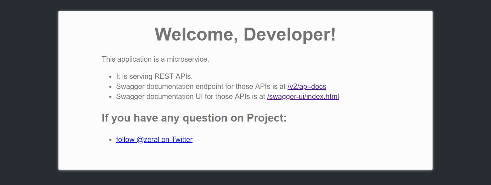
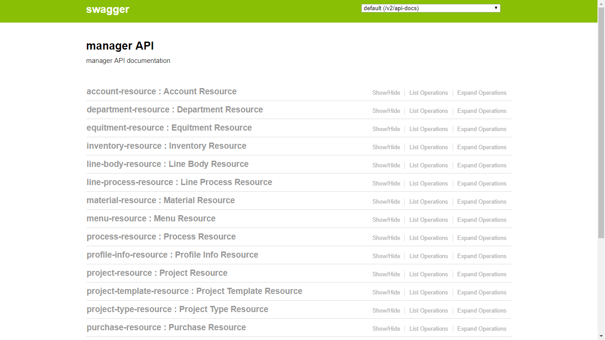

# 基于 SpringBoot、JHipster 的管理系统后台

------

该项目配合管理前台一起使用 【[查看](https://github.com/Zeral-Zhang/manager_web)】  

项目使用 JHipster 4.12.0 生成

  
  
## 开发

启动 dev 配置的项目:

    ./mvnw
    
    访问：localhost:8080，点击链接查看 api 文档
    
   

## 项目结构及使用

请移步 [JHipster](https://www.jhipster.tech/) 查看文档

## 支持

该项目有升级的计划，暂定功能：
  + 基于数据库的动作级别权限配置

## 帮助
如有对项目有任何疑问，技术问题或者非技术问题，请移步个人博客留言：

> [Zeral's Blog](http://zeral.top)
